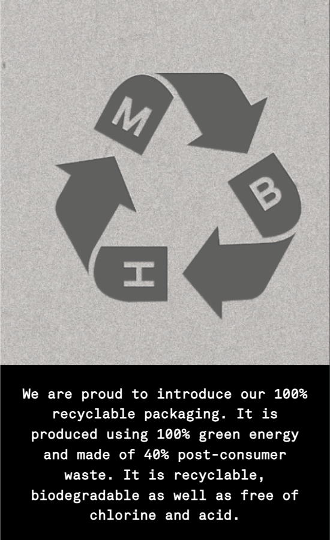

# Procesverslag
Markdown is een simpele manier om HTML te schrijven.  
Markdown cheat cheet: [Hulp bij het schrijven van Markdown](https://github.com/adam-p/markdown-here/wiki/Markdown-Cheatsheet).

Nb. De standaardstructuur en de spartaanse opmaak van de README.md zijn helemaal prima. Het gaat om de inhoud van je procesverslag. Besteedt de tijd voor pracht en praal aan je website.

Nb. Door *open* toe te voegen aan een *details* element kun je deze standaard open zetten. Fijn om dat steeds voor de relevante stuk(ken) te doen.


## Jij

<details open>
  <summary>uitwerken voor kick-off werkgroep</summary>

  ### Auteur:
  Sara Atilgan (vervangen door jouw naam)

  #### Je startniveau:
  Rood

  #### Je focus:
  Ik wil het liefst beide toepassen, maar als ik het qua tijd niet red dan alleen responsive.
 
</details>


## Je website

<details open>
  <summary>uitwerken voor kick-off werkgroep</summary>
  Ik ga proberen een verbeterde versie maken van de website: 

[MISBHV | Club Wear Solutions™](https://misbhv.com/eu/en/)

MiSBHV is een kleding merk en op hun website verkopen ze verschillende items.

  ### Je opdracht:
  https://misbhv.com/eu/en/

  #### Screenshot(s) van de eerste pagina (small screen homepagina misbhv): 
  
  ##
  
  ##
  

  #### Screenshot(s) van de tweede pagina (small screen all woman clothing):
  All woman clothing pagina
  ##
  
 
</details>


## Toegankelijkheidstest 1/2 (week 1)

<details>
  <summary>uitwerken na test in 2<sup>e</sup> werkgroep</summary>

  ### Bevindingen
  Lijst met je bevindingen die in de test naar voren kwamen:
  <ul>
  </ul>

</details>


## Breakdownschets (week 1)

<details>
  <summary>Ik wil verschillende elementen aanpassen. 
    Zo heb ik een logischer volgorde gemaakt van de content die ik op de homepagina wil laten zien</summary>

  ### Homepagina: 
  

<details>
  <summary>De tekst met ‘new in’ of ‘black week’ lijken op knoppen dus wil ik die veranderen in een label. 
    Verder wil ik ‘voeg toe aan winkelmand’ knoppen toevoegen.</summary>

  ### All woman clothing: 
  

<details>
  <summary>De menu items wil ik alleen verticaal aan de linkerkant uitlijnen. Verder wil ik deze links ook hover states geven en via mobiele formaat een state toepassen aan de links zodat de gebruiker weet op welke pagina hun zijn. </summary>

  ### Navigatie menu: 
  

</details>


## Voortgang 1 (week 2)

<details>
  <summary>Ik begon met het maken van een navigatie menu met alle items. Het begin ging een beetje stroef, omdat ik al een tijdje niet bezig ben geweest met coderen. Ik heb daarom ook veel onderzoek gedaan naar verschillende responsive nav menu’s. Voor mijn mobiele formaat wil ik gebruik maken van een hamburger menu. Het liefst zonder Javascript.</summary>

  ### Stand van zaken
  hier dit ging goed & dit was lastig (neem ook screenshots op van delen van je website en code)
  
  Na een tijdje zoeken kwam ik uit op een code voor een responsive hamburger menu via codepen: 
  
  Deze code begreep ik en ik wist deze goed toe te passen. Het probleem was is dat deze persoon block elementen gebruikt en ook display:float bij een block 
  element. Ik probeerde de code zelf een beetje aan te passen, zodat het wel semantisch correct is en geen fout meldingen geeft. Dit werkte niet. Ik kreeg 
  uiteindelijk ook mijn li elementen niet meer te zien. Ik had blijkbaar iets niet goed gedaan dus ben op zoek gegaan naar een andere code.
  
  bron hamburger menu codepen: [https://codepen.io/mutedblues/pen/MmPNPG](https://codepen.io/mutedblues/pen/MmPNPG)
</details>
<details>
Omdat er vaak gebruik wordt gemaakt van divs en heel veel classes vond ik het lastig om dit niet te gebruiken of weg te halen. Ik denk het de reden is dat sommige uitgewerkte code’s niet correct waren (vanwege verkeerde elementen selecteren in css). Ik heb namelijk gebruik gemaakt van een andere code (zie bron hieronder). In het begin ging het best prima, maar uiteindelijk gingen alle li elementen naar boven schuiven wanneer ik dus het menu ging uitklappen (iets met height en position te maken?). Ook gingen de hamburger menu lines raar bewegen en vormde ze geen x wanneer het menu is uitgeklapt. 

bron hamburger menu css: [https://alvarotrigo.com/blog/hamburger-menu-css](https://alvarotrigo.com/blog/hamburger-menu-css)

  

  <p>Orginele code:</p>

```css
@import url("https://fonts.googleapis.com/css2?family=Poppins:ital,wght@0,100;0,200;0,300;0,400;0,500;0,600;0,700;0,800;0,900;1,100;1,200;1,300;1,400;1,500;1,600;1,700;1,800;1,900&display=swap");

* {
  margin: 0;
  padding: 0;
  box-sizing: border-box;
}

body {
  font-family: "Poppins", sans-serif;
}

.container {
  max-width: 1050px;
  width: 90%;
  margin: auto;
}

.navbar {
  width: 100%;
  box-shadow: 0 1px 4px rgb(146 161 176 / 15%);
}

.nav-container {
  display: flex;
  justify-content: space-between;
  align-items: center;
  height: 62px;
}

.navbar .menu-items {
  display: flex;
}

.navbar .nav-container li {
  list-style: none;
}

.navbar .nav-container a {
  text-decoration: none;
  color: #0e2431;
  font-weight: 500;
  font-size: 1.2rem;
  padding: 0.7rem;
}

.navbar .nav-container a:hover{
    font-weight: bolder;
}

.nav-container {
  display: block;
  position: relative;
  height: 60px;
}

.nav-container .checkbox {
  position: absolute;
  display: block;
  height: 32px;
  width: 32px;
  top: 20px;
  left: 20px;
  z-index: 5;
  opacity: 0;
  cursor: pointer;
}

.nav-container .hamburger-lines {
  display: block;
  height: 26px;
  width: 32px;
  position: absolute;
  top: 17px;
  left: 20px;
  z-index: 2;
  display: flex;
  flex-direction: column;
  justify-content: space-between;
}

.nav-container .hamburger-lines .line {
  display: block;
  height: 4px;
  width: 100%;
  border-radius: 10px;
  background: #0e2431;
}

.nav-container .hamburger-lines .line1 {
  transform-origin: 0% 0%;
  transition: transform 0.4s ease-in-out;
}

.nav-container .hamburger-lines .line2 {
  transition: transform 0.2s ease-in-out;
}

.nav-container .hamburger-lines .line3 {
  transform-origin: 0% 100%;
  transition: transform 0.4s ease-in-out;
}

.navbar .menu-items {
  padding-top: 120px;
  box-shadow: inset 0 0 2000px rgba(255, 255, 255, .5);
  height: 100vh;
  width: 100%;
  transform: translate(-150%);
  display: flex;
  flex-direction: column;
  margin-left: -40px;
  padding-left: 50px;
  transition: transform 0.5s ease-in-out;
  text-align: center;
}

.navbar .menu-items li {
  margin-bottom: 1.2rem;
  font-size: 1.5rem;
  font-weight: 500;
}

.logo {
  position: absolute;
  top: 5px;
  right: 15px;
  font-size: 1.2rem;
  color: #0e2431;
}

.nav-container input[type="checkbox"]:checked ~ .menu-items {
  transform: translateX(0);
}

.nav-container input[type="checkbox"]:checked ~ .hamburger-lines .line1 {
  transform: rotate(45deg);
}

.nav-container input[type="checkbox"]:checked ~ .hamburger-lines .line2 {
  transform: scaleY(0);
}

.nav-container input[type="checkbox"]:checked ~ .hamburger-lines .line3 {
  transform: rotate(-45deg);
}

.nav-container input[type="checkbox"]:checked ~ .logo{
  display: none;
}
```
<details>
<p>Mijn eigen code:</p>

 

 ##
 
 

 ##

 


</details>


## Voortgang 2 (week 3)

<details>
  <summary>Omdat ik wat achterliep, ben ik eerst gaan focussen op het rest van de content. Zo ben ik begonnen met het maken van mijn eerste section. Ik had als eerst position absolute en position relative toegepast. Dit werkte prima, maar dit is niet de juiste manier. Hier door kunnen elementen verplaatsen want ze zitten op elkaar en ze zijn gepositioneerd. </summary>

  ### Stand van zaken
  hier dit ging goed & dit was lastig (neem ook screenshots op van delen van je website en code)

  ### black week section
   

  <p>Met hulp van Marten heb ik display grid gebruikt voor mijn section. Dit ging eerste instantie niet helemaal makkelijk, want de grid liet steeds extra rows zien terwijl ik de rows heb aangegeven met grid-template-rows. We wisten beide niet waar dit aan lag. </p>
  
   
   ##
   
   ##
   
   
<p>Ik ben vervolgens later nog is naar de code gaan kijken met Abby. Ik dacht misschien dat het aan de height lag en dat klopte ook. Ik had de height weggehaald en de rows aangepast. Nu stond alles op de juiste plek.</p>

##


<p>Ik ben vervolgens meerdere grid sections gaan maken. </p>


### Fall collection items section
<details>

<p>Bij de fall collection items section ging de grid ook extra rows aanmaken. Dit keer had ik geen height gebruikt, maar het stond nog steeds niet op de juiste plek. Ik ben toen gaan kijken wat er gebeurt als ik bij de items verschillende start & end rows en columns gebruik.</p>

##


<p>Ik heb verschillende dingen geprobeerd, maar nog steed kwam de img en de andere child elementen niet op de juiste plek te staan. Hier raakte ik gefrustreerd van, maar ik bleef het proberen.</p>


<p>Ik heb toen ook classes gebruikt voor de images, omdat ik misschien dacht dat ik de verkeerde css properties had genoteerd.</p>


<p>Html code fall collection items:</p>

  
</details>
Ik ben de volgende ochtend verder gegaan. Ik ben die dag ook weer verschillende dingen gaan proberen. Ik heb de eerste image over alle rows geplaatst om te zien of dit ook echt wat deed. Verder heb ik height: auto; aan de images gegeven om te kijken of dat wat zou doen.


##


<p>Dit werkte allemaal niet, dus ik heb de section rows aangepast en de rest van de elementen gepositioneerd in verschillende rows</p>


##

##

<p>De headings en images stonden al beter. Alles stond op zijn plek, maar de images waren niet dezelfde height. Dus ik heb inplaats van een height auto een 100% height gegeven.</p>
 
</details>

## Toegankelijkheidstest 2/2 (week 4)

<details>
  <summary>Tijdens de les hebben we met verschillende toegankelijkheidsbrillen gekeken naar onze gekozen websites. Hierbij heb ik met Abby een WCAG checklist ingevuld over toegankelijkheid.</summary>


##

##

##

##


  

  ### Bevindingen
  Lijst met je bevindingen die in de test naar voren kwamen (geef ook aan wat er verbeterd is):
   <ul>
  <li>Er zijn vele vormen van slechtziend zijn</li>
    <li>Meerdere vormen van beperkt zijn</li>
    <li>Veel websites maken nog geen gebruik van een duidelijke opzet (code) voor screenreaders</li>
    <li>mijn website maakt veel gebruik van divs en geen headings</li>
     <li>Je kan items op mijn uitgekozen website niet makkelijk toevoegen aan je winkelwagen</li>
     <li>Ook maakt de website veel gebruik van image banners zonder alternative text</li>
  </ul>

  <p>Ik wil zoveel mogelijk dingen aanpassen als dat lukt qua tijd.</p>
  

</details>

## Voortgang 3 (week 4)

<details>
  <summary>Ik ben vervolgens de rest van het content op de homepagina gaan doen. De recycle section ging moeiteloos, omdat er ook weinig elementen stonden. Later ben ik weer gaan focussen op de header.</summary>

  ### Stand van zaken
  hier dit ging goed & dit was lastig (neem ook screenshots op van delen van je website en code)

### Recycle section


##

##

<details>

### Newsletter section
De newsletter section child elementen heb ik uitgelijnd met text align center property. Dit ging goed, alleen kwam ik er achter dat het beter is om flexbox te gebruiken om elementen op een bepaalde manier uit te lijnen. 


##

##


<p>Code flexbox newsletter section</p>
<p>Ik heb vervolgens flexbox gebruikt en ze zo onder elkaar uitgelijnd met column property.</p>

```css
.newsletter_section {
	display: flex;
	flex-direction: column;
	align-items: center;
	gap: 1.5em;
	padding: 1.5em 0em 1.5em 0em;

	border-bottom: 1px solid white;
}

.newsletter_section h1 {
	align-self: center;
	margin: auto;

	/* styling */
	letter-spacing: var(--letter-spacing);
	text-transform: uppercase;
	font-size: var(--font-size-kop-mobiel);
	color: var(--color-text-db);
	font-family: var(--font-family-kop);

}

.newsletter_section p {
	text-align: center;

    /*styling */
	font-family: var(--font-family-body);
	font-size: var(--font-size-body-mobiel);
	line-height: 1.5em;
	color: var(--color-text-db);
	padding: 0em 1.5em 0em 1.5em;
}

.newsletter_section input {
	align-self: center;
	justify-content: center;
	width: 	15em;
	height: auto;
	box-sizing: border-box;
	padding: 0.8em;

	/*styling*/
	font-size: var(--font-size-body-mobiel);
	font-family: var(--font-family-body);
	border: 2px solid var(--color-specialelement);
	border-radius: 4px;
}

.newsletter_section label {
	font-size: var(--font-size-body-mobiel);
	font-family: var(--font-family-body);
	font-weight: bolder;
	color: var(--color-text-db);
}

.newsletter_section button {
	/*styling*/
	padding: 0.5em 1em 0.5em 1em;
	border: 1px  solid var(--color-specialelement);
	background-color: #fff;
	border-radius: 5px;
	color: var(--color-specialelement);
	font-family: var(--font-family-kop);
	font-weight: 600;
	font-size: var(--font-size-body-mobiel);
	box-shadow: 0px 2px 3px -2px black;
}

.newsletter_section button:active {
	background-color: var(--color-specialelement);
	color: #fff;
}

```

</details>

### Navigatie menu:
<details>Ik ben daarna weer verder gegaan met mijn navigatie menu. Ik ben onderzoek gaan doen naar tutorials die ook gebruik maken van submenu’s en die responsive zijn. Ik kwam uit op eentje die gebruik maakt van flexbox en die een hamburger animatie heeft. 
	
bron: [https://webdesign.tutsplus.com/how-to-build-a-responsive-navigation-bar-with-flexbox--cms-33535t](https://webdesign.tutsplus.com/how-to-build-a-responsive-navigation-bar-with-flexbox--cms-33535t) 

<p>Met deze navigatie menu had ik wat moeite, omdat deze tutorial ook gebruik maakte van heel veel classes. Ook de hoeveelheid elementen die ik in mijn header had staan maakte het chaotisch. Ik begon eerst met het aanpassen van verschillende elementen zodat het voor mij er logisch uit ziet en dat er zo min mogelijk classes worden gebruikt. Dit ging niet helemaal goed, want de subitems kreeg ik niet te zien (zie voorbeeld hier onder). Daarom ben ik uiteindelijk verder gegaan met alle elementen die ze gebruiken in de tutorial.</p>


<p>Zo had ik verschillende items en subitems. Ook had ik een aparte ul voor het logo, de winkelwagen, de search button en de log in en sign up list items. Dit allemaal zat in een navigatie en in een header.</p>


<p>CSS styling:</p>


##

##

##


<p>Javascript hamburger animatie en menu openen</p>


<p>De hamburger animatie werkte goed alleen de elementen waren niet op de juiste plek gepositioneerd. Ik probeerde dit zelf nog te veranderen, maar dat ging ook niet helemaal zoals ik het wou. Op groter scherm kreeg ik ook een groot wit vlak te zien. Waarschijnlijk door de background die op none stond, maar dit stond ook in de tutorial. </p>


##

	
</details>

### Final  
<details>
<summary>Aan de hand van feedback van Marten heb ik geprobeerd het navigatie menu aan te passen, zodat de elementen op de juiste plek gepositioneerd zijn en logisch is qua volgorde in mijn html</summary>

<p>Tips van Marten</p>


##


<p>Ik heb geprobeerd om de items in een logische volgorde te zetten en alle elementen in de nav te zetten. Omdat de items allemaal classes hadden heb ik geprobeerd de classes weg te halen. Dit werd super chaotisch en ik wist niet meer hoe ik dit kon fixen. Ik heb het uiteindelijk weggehaald.</p>

<details>
<p>Ik ben toen weer gaan kijken voor tutorials die makkelijk te volgen zijn. Ik werd geïrriteerd, want dit duurde te lang. Ik ben toen hulp gaan vragen aan Abby en zij heeft mij goed op weg geholpen.</p>

<p>ik ben eerst zelf begonnen met het maken van een navigatie menu. Het liefst heb ik natuurlijk sub menu's, maar ik ging mij eerst focussen op het belangrijkste gedeelte.</p>


##
<p>Hier heb ik de elementen in de nav gezet als tip van Abby</p>

##
<p>Vervolgens heb ik een class hidden toegevoegd om de list elementen te kunnen zien wanneer het menu uitklapt en weg te halen wanneer het menu inklapt.</p>

##

##


<p>Vervolgens heeft Abby mij geholpen om de elementen met flexbox uit te lijnen. Uiteindelijk heb ik door de hulp van Abby de list items precies onder het logo kunnen uitlijnen en de (log in, sign up, search icon & shopping bag) helemaal aan de rechterkant gepositioneerd</p>

<details>
<p>Ik heb daarna wat styling properties toegepast aan mijn nav elementen en ik heb vervolgens het menu een uitklap functie gegeven via javascript.</p>


##


<p>Javascript</p>

```js
openIcon.addEventListener("click", function () {
    openMenu.classList.toggle("hidden");
});

closeIcon.addEventListener("click", function () {
    openMenu.classList.toggle("hidden");   
})

```
 
</details>


## Eindgesprek (week 5)

<details>
  <summary>uitwerken voor eindgesprek</summary>

  ### Je uitkomst - karakteristiek screenshots:
  


  ### Dit ging goed/Heb ik geleerd: 
  Korte omschrijving met plaatjes

  


  ### Dit was lastig/Is niet gelukt:
  Korte omschrijving met plaatjes

  
</details>


## Bronnenlijst

<details open>
  <summary>continu bijhouden terwijl je werkt</summary>

  Nb. Wees specifiek ('css-tricks' als bron is bijv. niet specifiek genoeg). 
  Nb. ChatGpT en andere AI horen er ook bij.
  Nb. Vermeld de bronnen ook in je code.

  1. bron 1
  2. bron 2
  3. ...

</details>
